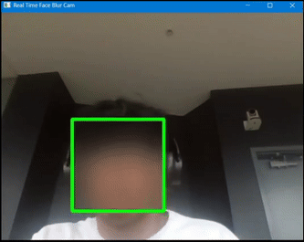
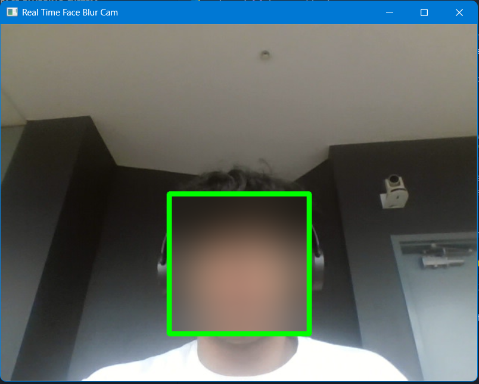

# Real-Time Face Blurring with OpenCV

A simple **computer vision project** that detects and blurs human faces in real time using **Python** and **OpenCV**.  
This program demonstrates how Haar cascade classifiers and Gaussian blurring can be used to protect privacy in live video streams.

**Static Screenshot**

---

## How It Works

1. The webcam feed is captured frame by frame using `cv2.VideoCapture()`.
2. Each frame is converted to grayscale to improve face detection performance.
3. Faces are detected using OpenCV’s pre-trained **Haar Cascade Classifier**.
4. A **Gaussian blur** is applied to each detected region of interest (ROI).
5. Bounding boxes and labels are overlaid for visualization.
6. Press **`q`** to quit.

---

